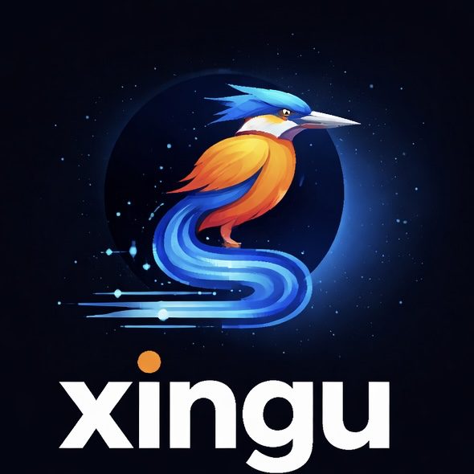

<p align="center">
  
</p>

<h1 align="center">xingu</h1>

<p align="center">
  <strong>Unofficial</strong> Amazon AppStore CLI — for humans and agents.<br>
  Named after the <a href="https://en.wikipedia.org/wiki/Xingu_River">Xingu River</a>, a major tributary of the Amazon.<br>
</p>

## Install

### From source

```bash
cargo install --path .
```

### Build from repo

```bash
git clone <repo-url>
cd xingu
cargo build --release
./target/release/xingu --help
```

## Setup

1. Go to the [Amazon Developer Console](https://developer.amazon.com/)
2. Navigate to **My Settings > API Access**
3. Create a new **Security Profile** and note your Client ID and Client Secret
4. Attach the security profile to the **App Submission API**

```bash
xingu auth setup
# Enter your Client ID and Client Secret when prompted

xingu auth login
# Acquires and caches an OAuth token (~1 hour TTL)
```

### Environment variables

| Variable | Description |
|----------|-------------|
| `XINGU_TOKEN` | Pre-obtained bearer token (highest priority) |
| `XINGU_CLIENT_ID` | OAuth client ID |
| `XINGU_CLIENT_SECRET` | OAuth client secret |
| `XINGU_BASE_URL` | Override API base URL (for testing) |

## Usage

```bash
# Get app details (App ID from Developer Console → My Apps → Additional Information)
xingu apps get <app-id>

# Create an edit (draft version)
xingu edits create <app-id>

# Upload an APK
xingu apks upload <app-id> <edit-id> --file app.apk

# Commit (publish) the edit
xingu edits commit <app-id> <edit-id>

# One-step publish: create edit → upload APK → commit
xingu +publish <app-id> --file app.apk

# Get app status + active edit
xingu +status <app-id>

# Update store listing
xingu +update-listing <app-id> --locale en-US --title "My App" --description "..."
```

## Commands

| Command | Description |
|---------|-------------|
| `auth setup` | Configure API credentials |
| `auth login` | Acquire fresh OAuth token |
| `auth token` | Print current access token |
| `apps get` | Get active edit for an app |
| `edits create/get/get-previous/validate/delete/commit` | Manage edits |
| `apks list/get/upload/replace/delete` | Manage APK files |
| `listings list/get/update/delete` | Manage store listings per locale |
| `details get/update` | Manage app details |
| `images list/upload/delete/delete-all` | Manage screenshots/icons per locale |
| `videos list/upload/delete/delete-all` | Manage videos per locale |
| `availability get/update` | Manage availability and scheduling |
| `targeting get/update` | Manage APK device targeting |
| `+publish` | One-step: edit → upload → commit |
| `+status` | App info + active edit summary |
| `+update-listing` | Update listing fields directly |

## Global flags

| Flag | Default | Description |
|------|---------|-------------|
| `--output json\|table` | `json` | Output format |
| `--dry-run` | `false` | Preview requests without executing |
| `--verbose` | `false` | Show HTTP method, URL, status, timing |
| `--timeout <secs>` | `30` | Request timeout in seconds |

## Exit codes

| Code | Meaning |
|------|---------|
| 0 | Success |
| 1 | API error |
| 2 | Authentication error |
| 3 | Validation error |
| 4 | Network error |

## Prerequisites

The Amazon App Submission API only manages **subsequent versions** of an app. You must submit the first version of your app through the [Developer Console](https://developer.amazon.com/). After the first version is published, you can use xingu (and the API) to manage all future updates.

### App state requirements

Not all app states allow API operations. The API will return `412 Precondition Failed` if the app is in a state that blocks edits:

| App state | Can create edits? |
|-----------|-------------------|
| Published | ✅ Yes |
| Incomplete (never submitted) | ❌ No — submit first version via Console |
| Submitted / Under Review | ❌ No — wait for review to complete |
| Suppressed | ❌ No |

### ETags

The Amazon API uses ETags for concurrency control. Most `PUT`, `DELETE`, and some `POST` operations (validate, commit, delete) require an `If-Match` header with the current ETag. xingu handles this automatically — it fetches the ETag from a prior `GET` request before sending mutating requests.

## Agent integration

Agents should invoke `xingu` as a subprocess with proper argument arrays (not shell string interpolation) to avoid command injection. All commands output structured JSON by default.

### Typical agent workflow

```bash
# 1. Authenticate (token lasts ~1 hour)
xingu auth login

# 2. Check app state before doing anything
xingu +status <app-id>
# → { "appId": "...", "activeEdit": { "id": "...", "status": "IN_PROGRESS" } }
# → { "appId": "...", "activeEdit": {} }  ← no active edit

# 3a. One-step publish (create edit → upload → commit)
xingu +publish <app-id> --file app.apk

# 3b. Or step-by-step for more control:
EDIT=$(xingu edits create <app-id> | jq -r .id)
xingu apks upload <app-id> $EDIT --file app.apk
xingu edits validate <app-id> $EDIT        # catch errors before committing
xingu edits commit <app-id> $EDIT

# 4. Update metadata without uploading a new APK
xingu +update-listing <app-id> --locale en-US --title "My App" --description "..."

# 5. Preview any command without executing
xingu +publish <app-id> --file app.apk --dry-run
# → POST /applications/<app-id>/edits
# → POST /applications/<app-id>/edits/<edit_id>/apks/upload (file: app.apk)
# → POST /applications/<app-id>/edits/<edit_id>/commit
```

### Error handling

Agents should check exit codes and parse JSON error responses:

```bash
output=$(xingu edits create <app-id> 2>&1)
exit_code=$?

case $exit_code in
  0) edit_id=$(echo "$output" | jq -r .id) ;;
  1) echo "API error: $output" ;;       # e.g. 412 Precondition Failed
  2) echo "Auth error: $output" ;;       # token expired — run `xingu auth login`
  3) echo "Validation error: $output" ;; # invalid input
  4) echo "Network error: $output" ;;    # timeout or connectivity issue
esac
```

API errors return structured JSON:
```json
{
  "httpCode": 412,
  "message": "Precondition Failed",
  "errors": [{ "errorCode": "error_new_version_creation_not_allowed", "errorMessage": "..." }]
}
```

### Token management

Tokens expire after ~1 hour. Agents should:
1. Call `xingu auth login` before a workflow (or on 401 errors)
2. Use `XINGU_CLIENT_ID` and `XINGU_CLIENT_SECRET` env vars for non-interactive auth
3. Or set `XINGU_TOKEN` directly if managing tokens externally

### Skills

YAML skill definitions in `skills/` for common workflows:

| Skill | File | Description |
|-------|------|-------------|
| Publish app | `publish-app.yaml` | One-step: edit → upload → commit |
| Upload APK | `upload-apk.yaml` | Upload APK to an existing edit |
| Update listing | `update-listing.yaml` | Update store listing fields per locale |
| Check status | `check-status.yaml` | Get app info + active edit |
| Validate edit | `validate-edit.yaml` | Validate an edit before committing |
| Check targeting | `check-targeting.yaml` | View APK device targeting |

Skills use Jinja-style templates with required/optional parameters. See individual YAML files for details.

## Security

### Credential storage

Credentials are stored in the OS keyring (macOS Keychain, Linux secret-service) when available. Falls back to `~/.config/xingu/credentials.json` with `0600` permissions. The config directory is set to `0700`.

### Token handling

- `xingu auth token` outputs the full bearer token to stdout (for piping). Be careful with shell history and logging.
- Token cache (`token_cache.json`) has `0600` permissions and expires after ~1 hour.
- `--verbose` mode never logs tokens or credentials.

### Base URL override

`XINGU_BASE_URL` is restricted to HTTPS amazon.com domains and localhost. This prevents credential exfiltration via SSRF if an attacker controls environment variables.

## Disclaimer

This is an unofficial, community-built tool. It is not affiliated with, endorsed by, or supported by Amazon. "Amazon", "Amazon Appstore", and related names are trademarks of Amazon.com, Inc.

## License

MIT
